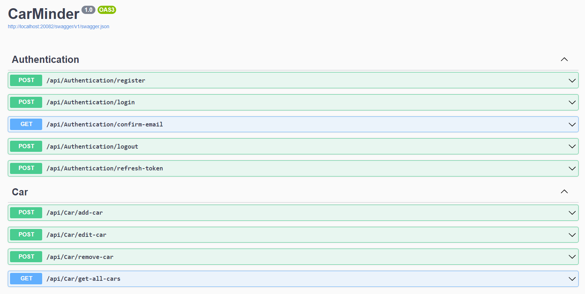

# CarMinder API

This ASP.NET Core API is an essential component of the [CarMinder mobile application](https://github.com/milosz002/CarMinderMobileApp), a comprehensive vehicle management system. The API facilitates communication between the mobile application and the backend server, including database interactions for user and vehicle management.

## Features

The CarMinder API provides several endpoints to support authentication processes and vehicle management, ensuring a seamless user experience within the CarMinder app. Below is an overview of the available endpoints:

### Authentication
- **Register Account**: `POST api/Authentication/register` Allows users to register an account.
- **Login**: `POST api/Authentication/login` Enables user login.
- **Confirm Email**: `GET api/Authentication/confirm-email` Confirms the user's email address.
- **Logout**: `POST api/Authentication/logout` Logs out the user.
- **Refresh Token**: `POST api/Authentication/refresh-token` Refreshes or updates the JWT token.

### Car Management
- **Add Car**: `POST api/Car/add-car` Adds a vehicle to the server database.
- **Edit Car**: `POST api/Car/edit-car` Edits a vehicle in the server database.
- **Remove Car**: `POST api/Car/remove-car` Removes a vehicle from the server database.
- **Get All Cars**: `GET api/Car/get-all-cars` Returns a list of the user's vehicles from the database.

## Technologies Used

The CarMinder API is built using ASP.NET Core with the following key technologies and packages:

- **Entity Framework Core**: An object-database mapper for .NET, enabling .NET developers to work with a database using .NET objects.
- **Microsoft Identity**: For implementing authentication and identity management.
- **JWT Authentication**: For securing the API using JSON Web Tokens.
- **MailKit**: A cross-platform mail client library.
- **Swashbuckle (Swagger)**: For API documentation and integration testing.
